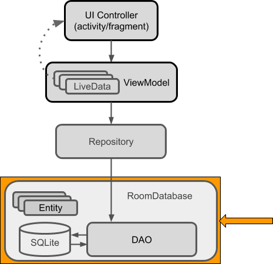

# TodoApplication

Task is a simple to use to-do list app that can help you plan, track, and get more tasks done. You can create unlimited tasks, set status, assign tasks to team members, create to-do list task in tasks. 

## Features
- Add, Delete, update and Read functionality(CRUD operation) for Todo task.
- Swipe Functionality for Delete of Task.
- Tap for Update of Task.
- Notification for reminder.
- Task Details store in SQLite Database.
- Testing of the database done.

##  Architecture

Model–view–viewmodel (MVVM) is a software architectural pattern that facilitates the separation of the development of the graphical user interface (the view) be it via a markup language or GUI code from the development of the business logic or back-end logic (the model) so that the view is not dependent on any specific model platform. The view model of MVVM is a value converter,meaning the view model is responsible for exposing (converting) the data objects from the model in such a way that objects are easily managed and presented. In this respect, the view model is more model than view, and handles most if not all of the view's display logic.The view model may implement a mediator pattern, organizing access to the back-end logic around the set of use cases supported by the view.
There are 3 parts to the Model-View-ViewModel architecture:-

   1. <b><u>Model</u></b> is the data layer of your app. It abstracts the data source.
   2. <b><u>View</u></b> contains the UI of your app. Most often it’s implemented as an Activity or Fragment. View informs ViewModel of user interactions and displays results received from the ViewModel. View should be lightweight and contain zero to very little business logic.
   3. <b><u>ViewModel</u></b> serves as a bridge between your View and Model. It works with the Model to get and save the data. The View observes and reacts to the data changes exposed by the ViewModel.

Here is a typical high-level MVVM app architecture:
 
The model part contains database related class such as DAO, Task Model, Task Database class. The repository class is also related with model but it is the class that helps communicating between Model and View Model class. The viewmodel class provides live data to the View part or UI which basically include activity or fragments.

# Getting Start

## License
Copyright 2021 Mohan Prakash, Inc.

Licensed to the Apache Software Foundation (ASF) under one or more contributor license agreements. See the NOTICE file distributed with this work for additional information regarding copyright ownership. The ASF licenses this file to you under the Apache License, Version 2.0 (the "License"); you may not use this file except in compliance with the License. You may obtain a copy of the License at

http://www.apache.org/licenses/LICENSE-2.0

Unless required by applicable law or agreed to in writing, software distributed under the License is distributed on an "AS IS" BASIS, WITHOUT WARRANTIES OR CONDITIONS OF ANY KIND, either express or implied. See the License for the specific language governing permissions and limitations under the License.
